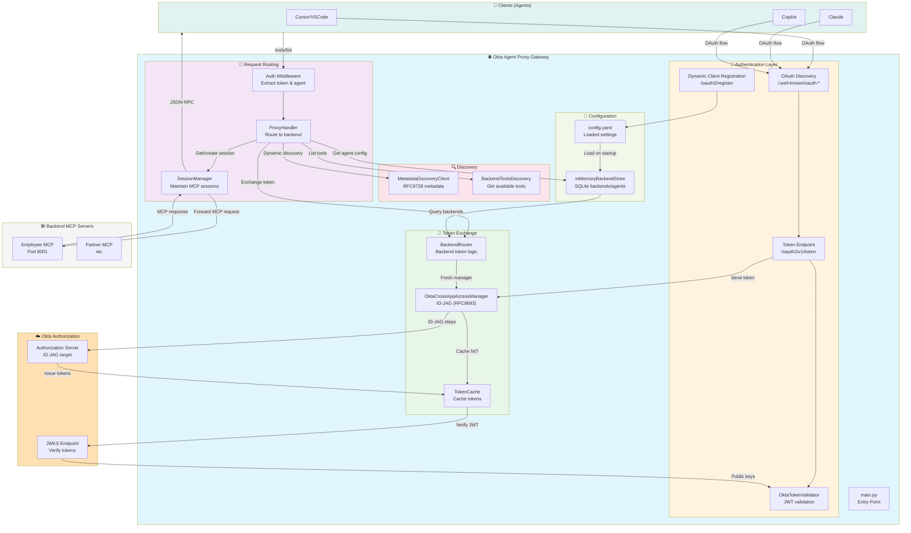
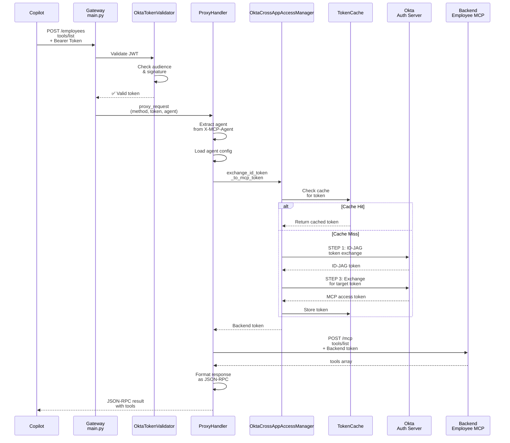
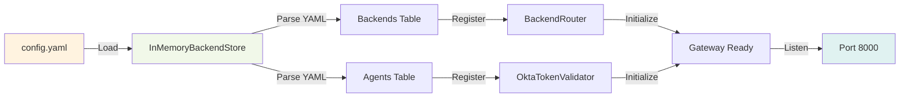

# Okta Agent Proxy - Architecture

## System Overview



---

## Component Details

### 🔑 Authentication Layer (`auth/`)

| Component | File | Purpose |
|-----------|------|---------|
| **OktaTokenValidator** | `okta_validator.py` | JWT validation, JWKS caching, audience checking |
| **OktaCrossAppAccessManager** | `cross_app_access.py` | ID-JAG token exchange (RFC8693) using Okta AI SDK |
| **OAuth Endpoints** | `main.py` | DCR, authorize, token endpoints |

### 📍 Request Routing (`proxy/` + `middleware/`)

| Component | File | Purpose |
|-----------|------|---------|
| **ProxyHandler** | `proxy/handler.py` | Main request router, auth validation, backend selection |
| **SessionManager** | `proxy/session_manager.py` | MCP session creation, caching, header management |
| **Auth Middleware** | `middleware/auth.py` | Extract bearer tokens, agent identity |
| **MCP Transparent Proxy** | `middleware/mcp_transparent_proxy.py` | Determine if request needs forwarding |

### 🔄 Token Exchange (`backends/` + `cache/`)

| Component | File | Purpose |
|-----------|------|---------|
| **BackendRouter** | `backends/router.py` | Coordinate token exchange, determine ID-JAG mode |
| **TokenCache** | `cache/token_cache.py` | In-memory token caching with TTL |
| **OktaCrossAppAccessManager** | `auth/cross_app_access.py` | 4-step ID-JAG flow |

### 🔍 Discovery (`discovery/`)

| Component | File | Purpose |
|-----------|------|---------|
| **MetadataDiscoveryClient** | `discovery/metadata_client.py` | RFC9728 metadata discovery for dynamic mode |
| **BackendToolsDiscovery** | `discovery/backend_tools.py` | Discover available MCP tools from backends |

### 💾 Configuration (`storage/` + `config.py`)

| Component | File | Purpose |
|-----------|------|---------|
| **InMemoryBackendStore** | `storage/in_memory.py` | SQLite in-memory DB, loads YAML on startup |
| **AgentModel / BackendModel** | `storage/models.py` | SQLAlchemy ORM models |
| **GatewaySettings** | `config.py` | Pydantic config models |

---

## Request Flow Example: `tools/list`



---

## Configuration & Startup



---

## Key Design Patterns

### 1. **Separation of Concerns**
- `main.py` = HTTP/MCP protocol handling
- `proxy/handler.py` = Business logic routing
- `auth/` = Token management
- `backends/` = Backend coordination

### 2. **Two Auth Methods**
- **OAuth (for Agents)**: Copilot, Claude, Cursor → Okta
- **Service Auth (for Backends)**: Gateway → Backend (static keys, basic auth, ID-JAG)

### 3. **Token Exchange Pipeline**
```
User ID Token (from Okta OAuth)
    ↓
[BackendRouter selects ID-JAG mode]
    ↓
[OktaCrossAppAccessManager does 4-step exchange]
    ↓
[Backend Token cached in TokenCache]
    ↓
[ProxyHandler adds token to backend request]
```

### 4. **Session Management**
- Gateway maintains MCP `Session-Id` with each backend
- Sessions cached per backend to avoid recreating
- Used for stateful MCP interactions

---

## File Structure

```
okta-agent-proxy/
├── main.py                              # Entry point, HTTP/FastMCP
├── config.py                            # Pydantic config models
├── auth/
│   ├── okta_validator.py               # JWT validation
│   ├── cross_app_access.py             # ID-JAG token exchange
│   ├── agent_authz.py                  # Agent access control
│   └── backend_auth.py                 # Backend auth coordination
├── backends/
│   └── router.py                        # Backend token & routing logic
├── cache/
│   └── token_cache.py                  # In-memory token caching
├── proxy/
│   ├── handler.py                       # Main request router
│   └── session_manager.py               # MCP session caching
├── middleware/
│   ├── auth.py                          # Bearer token extraction
│   ├── agent_extractor.py              # Agent identification
│   ├── logging.py                       # Request logging
│   └── mcp_transparent_proxy.py         # Protocol detection
├── storage/
│   ├── base.py                          # Abstract store interface
│   ├── in_memory.py                     # SQLite in-memory DB
│   └── models.py                        # SQLAlchemy ORM models
├── discovery/
│   ├── metadata_client.py              # RFC9728 discovery
│   └── backend_tools.py                # Tool discovery
└── metadata.py                          # Metadata response builders
```

---

## Technology Stack

| Layer | Technology |
|-------|-----------|
| **HTTP Server** | `uvicorn` + `starlette` |
| **MCP Framework** | `fastmcp` |
| **Config** | `pydantic` + YAML |
| **Database** | SQLite (in-memory) |
| **JWT** | `python-jose` + `cryptography` |
| **HTTP Client** | `httpx` (async) |
| **Token Exchange** | `okta-ai-sdk` (ID-JAG) |

