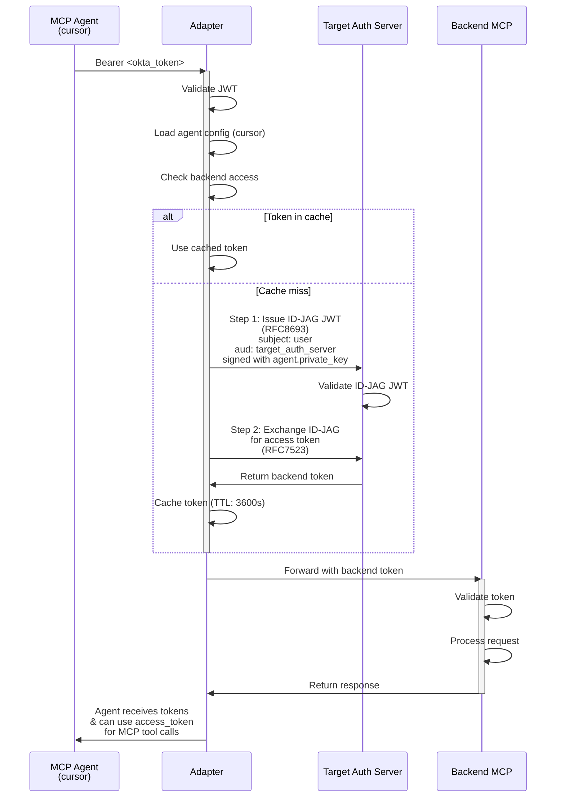
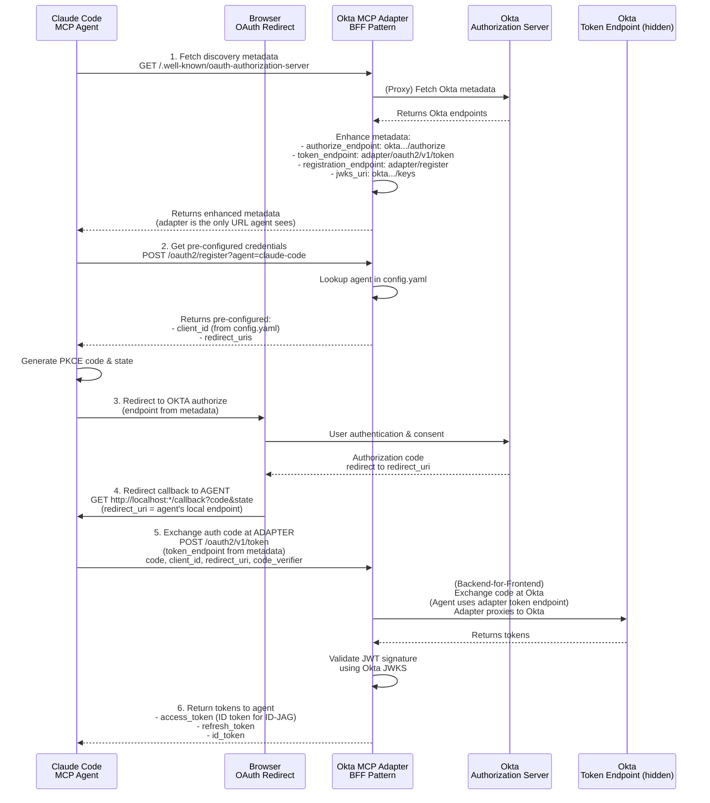
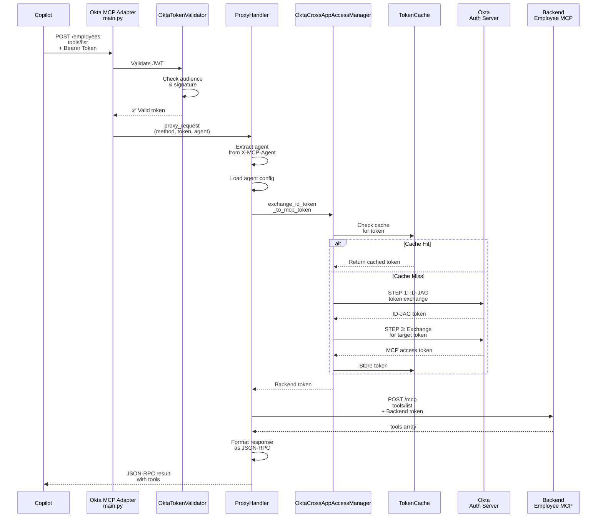

# Architecture Diagram - Okta MCP Adapter

## System Architecture

---

## Token Exchange Flow (ID-JAG)

---

## Frontend Login Flow: Agent Authentication via Adapter Discovery (BFF Pattern)

**Key Pattern**: Adapter acts as Backend-for-Frontend (BFF), proxying Okta discovery and intercepting the token endpoint. Agents only interact with adapter URLs, not Okta directly.

**BFF Pattern Benefits:**
- ✅ **Adapter controls token exchange**: Can add logging, security checks, token transformation
- ✅ **Hidden Okta complexity**: Agents only see adapter URLs
- ✅ **Pre-configured credentials**: DCR returns client_id from config.yaml
- ✅ **Single entry point**: All OAuth flows go through adapter
- ✅ **Security**: Adapter can validate, filter, and transform tokens

---

## Request Flow Example: `tools/list`

