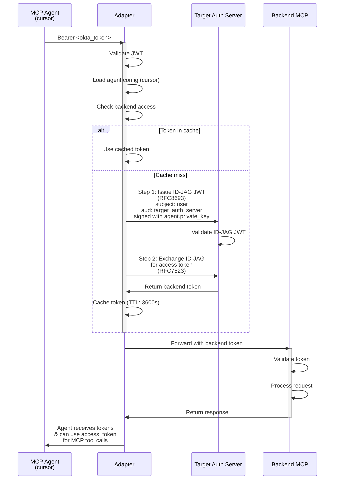
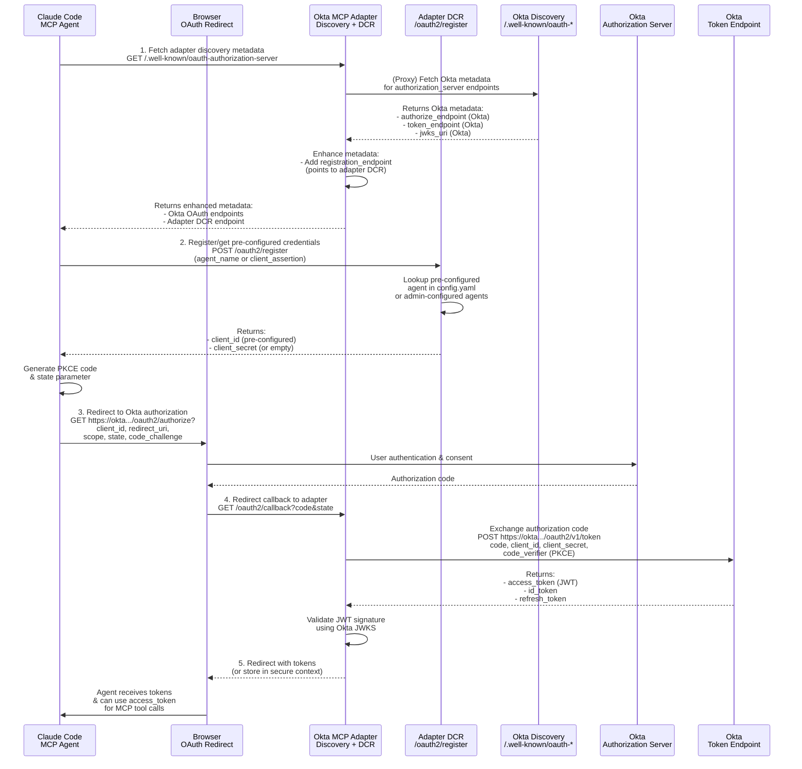
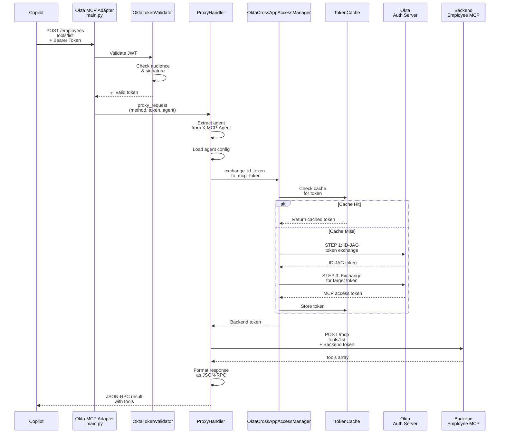

# Architecture Diagram - Okta MCP Adapter

## System Architecture


## Data Flow

### 1. Request Layer
```
MCP Client
  ├─ Headers: Authorization: Bearer <okta_token>
  ├─ Headers: X-Agent-ID: cursor
  ├─ Headers: Accept: application/json, text/event-stream
  └─ Body: {"jsonrpc":"2.0","method":"tools/list",...}
```

### 2. Validation Layer
```
Proxy receives request
  ├─ Extract Bearer token
  ├─ Validate JWT signature (Okta JWKS)
  ├─ Check token expiration
  ├─ Verify audience
  ├─ Extract agent_id from header
  ├─ Load agent config from store
  └─ Verify agent enabled
```

### 3. Authorization Layer
```
  ├─ Check: backend in agent.backend_access?
  ├─ Check: agent has required scopes?
  └─ Deny with 403 if unauthorized
```

### 4. Token Exchange Layer
```
  ├─ Check token cache (key: user_id:backend_name:agent_id)
  ├─ If miss:
  │  ├─ Issue ID-JAG JWT (using agent credentials)
  │  ├─ Exchange at target auth server
  │  ├─ Cache result with TTL
  │  └─ On 401: invalidate cache, return error
  └─ Use cached token
```

### 5. Request Forwarding Layer
```
  ├─ Select auth handler (okta-cross-app|pre-shared-key|service-account)
  ├─ Add auth headers to backend request
  ├─ Forward JSON-RPC request
  ├─ Handle response (200|401|other)
  └─ Return to client
```

## Component Responsibilities

| Component | Responsibility |
|-----------|-----------------|
| **FastMCP Server** | HTTP transport, JSON-RPC handling |
| **JWT Validator** | Signature verification, token validation |
| **Agent Extractor** | Parse X-Agent-ID header, load config |
| **Agent AuthZ** | Check backend_access, scopes |
| **Backend Router** | Path-to-backend mapping, discovery |
| **ID-JAG Issuer** | Create ID-JAG JWT (agent credentials) |
| **ID-JAG Exchanger** | Exchange JWT for backend token |
| **Token Cache** | Reduce token exchange latency |
| **Auth Handlers** | Create auth headers (3 methods) |
| **Request Forwarder** | Send to backend, handle response |
| **Backend Store** | CRUD for backends, persistence |
| **Agent Store** | CRUD for agents, persistence |
| **Audit Log** | Track all changes |

## Security Boundaries

```
┌─────────────────────────────────────────┐
│         MCP Client (Cursor)             │
│        (May be compromised)             │
└─────────────────┬───────────────────────┘
                  │ Bearer Token + X-Agent-ID
                  ↓
┌─────────────────────────────────────────┐
│   ⚠️  SECURITY BOUNDARY #1             │
│   Proxy validates token signature       │
│   Checks against Okta JWKS              │
└─────────────────┬───────────────────────┘
                  │ Validated JWT claims
                  ↓
┌─────────────────────────────────────────┐
│   ⚠️  SECURITY BOUNDARY #2             │
│   Proxy checks agent authorization      │
│   Verifies backend_access list          │
└─────────────────┬───────────────────────┘
                  │ Authorized backend
                  ↓
┌─────────────────────────────────────────┐
│   ⚠️  SECURITY BOUNDARY #3             │
│   Proxy exchanges token for backend     │
│   Uses agent-specific credentials       │
└─────────────────┬───────────────────────┘
                  │ Backend token
                  ↓
┌─────────────────────────────────────────┐
│    Backend MCP Server (Trusted)         │
│   (Must validate token independently)   │
└─────────────────────────────────────────┘
```

## Multi-Agent Architecture

```
┌──────────────────────────────────────────────────────┐
│              Adapter Configuration                   │
├──────────────────────────────────────────────────────┤
│                                                      │
│  Agent: cursor                                       │
│  ├─ client_id: 0oa_cursor_app                       │
│  ├─ private_key: (PKCS8)                            │
│  ├─ scopes: [mcp:read, mcp:write]                   │
│  └─ backend_access: [employees, finance]            │
│                                                      │
│  Agent: claude-code                                  │
│  ├─ client_id: 0oa_claude_code                      │
│  ├─ private_key: (PKCS8)                            │
│  ├─ scopes: [mcp:read]                              │
│  └─ backend_access: [partners]                       │
│                                                      │
│  Backend: employees (Okta Cross-App)                │
│  ├─ url: http://localhost:9001                      │
│  ├─ paths: [/employees, /hr]                        │
│  └─ target auth server: target-okta.okta.com        │
│                                                      │
│  Backend: partners (Pre-Shared Key)                  │
│  ├─ url: http://localhost:9002                      │
│  ├─ paths: [/partners]                              │
│  └─ key: partner_api_key_123                         │
│                                                      │
└──────────────────────────────────────────────────────┘
```

## Token Exchange Flow (ID-JAG)



---

## Frontend Login Flow: Agent Authentication via Adapter Discovery

**Key Pattern**: Adapter proxies Okta discovery metadata and provides its own Dynamic Client Registration (DCR) endpoint with pre-configured agent credentials.



**Why This Pattern?**
- ✅ **Pre-configured credentials**: Agents don't need dynamic registration with Okta
- ✅ **Centralized management**: Config defined in adapter (config.yaml)
- ✅ **Enhanced discovery**: Adapter adds its own DCR endpoint to Okta's metadata
- ✅ **Single adapter URL**: Agents only need adapter URL, not Okta URL
- ✅ **Transparent OAuth**: Actual OAuth still happens with Okta (authorize/token endpoints)

---

## Request Flow Example: `tools/list`



