# Architecture Diagram - Okta Agent Proxy

## System Architecture

```mermaid
graph TB
    subgraph MCP_Clients["MCP Clients"]
        Cursor["🖥️ Cursor IDE<br/>(Agent: cursor)"]
        ClaudeCode["💻 Claude Code<br/>(Agent: claude-code)"]
        Copilot["🔵 Copilot<br/>(Agent: copilot)"]
    end

    subgraph Proxy["Okta Agent Proxy<br/>(port 8000)"]
        FastMCP["FastMCP Server<br/>Streamable HTTP"]
        
        subgraph Auth_Layer["Authentication Layer"]
            TokenVal["JWT Validator<br/>(Okta JWKS cache)"]
            AgentExt["Agent Extractor<br/>(X-Agent-ID header)"]
        end
        
        subgraph AuthZ_Layer["Authorization Layer"]
            AgentAuthZ["Agent Authorization<br/>(backend_access check)"]
            ScopeVal["Scope Validator<br/>(mcp:read/write)"]
        end
        
        subgraph Routing_Layer["Routing Layer"]
            Router["Backend Router<br/>(path-based)"]
            Discovery["Metadata Discovery<br/>(RFC9728)"]
        end
        
        subgraph TokenEx_Layer["Token Exchange Layer"]
            IdJagIssuer["ID-JAG Issuer<br/>(JWT creation)"]
            IdJagEx["ID-JAG Exchanger<br/>(Token exchange)"]
            TokenCache["Token Cache<br/>(TTL: 3600s)"]
        end
        
        subgraph Proxy_Layer["Proxy Layer"]
            AuthHandler["Auth Handlers<br/>Okta | APIKey | Basic"]
            ProxyReq["Request Forwarder<br/>(httpx async)"]
        end
        
        subgraph Storage_Layer["Storage Layer"]
            Store["Backend Config Store<br/>(SQLite in-memory)"]
            AgentStore["Agent Store<br/>(SQLite in-memory)"]
            AuditLog["Audit Log<br/>(SQLite in-memory)"]
        end
        
        subgraph Config["Configuration"]
            YamlFile["config.yaml<br/>(Backends + Agents)"]
            EnvFile[".env<br/>(Okta credentials)"]
        end
    end

    subgraph Okta["Okta Identity Provider"]
        OktaAuth["🔐 Okta Org<br/>(dev-XXXXX.okta.com)"]
        JWKS["JWKS Endpoint<br/>(Key rotation)"]
        OAuthServer["OAuth 2.1 Server<br/>(Token endpoint)"]
    end

    subgraph Backends["Target MCP Servers"]
        EmployeesMCP["👥 Employees MCP<br/>(Okta Cross-App)"]
        PartnersMCP["🤝 Partners MCP<br/>(Pre-Shared Key)"]
        FinanceMCP["💰 Finance MCP<br/>(Service Account)"]
    end

    %% Client to Proxy
    Cursor -->|"Bearer Token<br/>X-Agent-ID: cursor"| FastMCP
    ClaudeCode -->|"Bearer Token<br/>X-Agent-ID: claude-code"| FastMCP
    Copilot -->|"Bearer Token<br/>X-Agent-ID: copilot"| FastMCP

    %% Proxy Flow
    FastMCP --> TokenVal
    FastMCP --> AgentExt
    TokenVal --> AuthZ_Layer
    AgentExt --> AgentAuthZ
    AgentAuthZ --> ScopeVal
    ScopeVal --> Router
    Router --> Discovery
    Discovery --> TokenEx_Layer
    IdJagIssuer --> IdJagEx
    IdJagEx --> TokenCache
    TokenCache --> AuthHandler
    AuthHandler --> ProxyReq

    %% Storage
    Store --> YamlFile
    AgentStore --> YamlFile
    AuditLog --> EnvFile
    
    %% Auth to Okta
    TokenVal -->|"JWKS Request"| JWKS
    IdJagIssuer -->|"Token Exchange<br/>(RFC8693)"| OAuthServer
    IdJagEx -->|"Exchange ID-JAG JWT<br/>(RFC7523)"| OAuthServer

    %% Proxy to Backends
    ProxyReq -->|"Bearer Token"| EmployeesMCP
    ProxyReq -->|"X-API-Key"| PartnersMCP
    ProxyReq -->|"Basic Auth"| FinanceMCP

    %% Styling
    classDef client fill:#4A90E2,stroke:#2E5C8A,stroke-width:2px,color:#fff
    classDef gateway fill:#F5A623,stroke:#B86E1F,stroke-width:2px,color:#fff
    classDef auth fill:#7ED321,stroke:#5FA919,stroke-width:2px,color:#fff
    classDef storage fill:#BD10E0,stroke:#8B0AA8,stroke-width:2px,color:#fff
    classDef okta fill:#00B4D8,stroke:#0077B6,stroke-width:2px,color:#fff
    classDef backend fill:#E84C3D,stroke:#A63028,stroke-width:2px,color:#fff

    class Cursor,ClaudeCode,Copilot client
    class FastMCP,Router,ProxyReq gateway
    class TokenVal,AgentExt,AgentAuthZ,IdJagIssuer,IdJagEx auth
    class Store,AgentStore,AuditLog storage
    class OktaAuth,JWKS,OAuthServer okta
    class EmployeesMCP,PartnersMCP,FinanceMCP backend
```



## Data Flow

### 1. Request Layer
```
MCP Client
  ├─ Headers: Authorization: Bearer <okta_token>
  ├─ Headers: X-Agent-ID: cursor
  ├─ Headers: Accept: application/json, text/event-stream
  └─ Body: {"jsonrpc":"2.0","method":"tools/list",...}
```

### 2. Validation Layer
```
Proxy receives request
  ├─ Extract Bearer token
  ├─ Validate JWT signature (Okta JWKS)
  ├─ Check token expiration
  ├─ Verify audience
  ├─ Extract agent_id from header
  ├─ Load agent config from store
  └─ Verify agent enabled
```

### 3. Authorization Layer
```
  ├─ Check: backend in agent.backend_access?
  ├─ Check: agent has required scopes?
  └─ Deny with 403 if unauthorized
```

### 4. Token Exchange Layer
```
  ├─ Check token cache (key: user_id:backend_name:agent_id)
  ├─ If miss:
  │  ├─ Issue ID-JAG JWT (using agent credentials)
  │  ├─ Exchange at target auth server
  │  ├─ Cache result with TTL
  │  └─ On 401: invalidate cache, return error
  └─ Use cached token
```

### 5. Request Forwarding Layer
```
  ├─ Select auth handler (okta-cross-app|pre-shared-key|service-account)
  ├─ Add auth headers to backend request
  ├─ Forward JSON-RPC request
  ├─ Handle response (200|401|other)
  └─ Return to client
```

## Component Responsibilities

| Component | Responsibility |
|-----------|-----------------|
| **FastMCP Server** | HTTP transport, JSON-RPC handling |
| **JWT Validator** | Signature verification, token validation |
| **Agent Extractor** | Parse X-Agent-ID header, load config |
| **Agent AuthZ** | Check backend_access, scopes |
| **Backend Router** | Path-to-backend mapping, discovery |
| **ID-JAG Issuer** | Create ID-JAG JWT (agent credentials) |
| **ID-JAG Exchanger** | Exchange JWT for backend token |
| **Token Cache** | Reduce token exchange latency |
| **Auth Handlers** | Create auth headers (3 methods) |
| **Request Forwarder** | Send to backend, handle response |
| **Backend Store** | CRUD for backends, persistence |
| **Agent Store** | CRUD for agents, persistence |
| **Audit Log** | Track all changes |

## Security Boundaries

```
┌─────────────────────────────────────────┐
│         MCP Client (Cursor)             │
│        (May be compromised)             │
└─────────────────┬───────────────────────┘
                  │ Bearer Token + X-Agent-ID
                  ↓
┌─────────────────────────────────────────┐
│   ⚠️  SECURITY BOUNDARY #1             │
│   Proxy validates token signature       │
│   Checks against Okta JWKS              │
└─────────────────┬───────────────────────┘
                  │ Validated JWT claims
                  ↓
┌─────────────────────────────────────────┐
│   ⚠️  SECURITY BOUNDARY #2             │
│   Proxy checks agent authorization      │
│   Verifies backend_access list          │
└─────────────────┬───────────────────────┘
                  │ Authorized backend
                  ↓
┌─────────────────────────────────────────┐
│   ⚠️  SECURITY BOUNDARY #3             │
│   Proxy exchanges token for backend     │
│   Uses agent-specific credentials       │
└─────────────────┬───────────────────────┘
                  │ Backend token
                  ↓
┌─────────────────────────────────────────┐
│    Backend MCP Server (Trusted)         │
│   (Must validate token independently)   │
└─────────────────────────────────────────┘
```

## Multi-Agent Architecture

```
┌──────────────────────────────────────────────────────┐
│              Gateway Configuration                   │
├──────────────────────────────────────────────────────┤
│                                                      │
│  Agent: cursor                                       │
│  ├─ client_id: 0oa_cursor_app                       │
│  ├─ private_key: (PKCS8)                            │
│  ├─ scopes: [mcp:read, mcp:write]                   │
│  └─ backend_access: [employees, finance]            │
│                                                      │
│  Agent: claude-code                                  │
│  ├─ client_id: 0oa_claude_code                      │
│  ├─ private_key: (PKCS8)                            │
│  ├─ scopes: [mcp:read]                              │
│  └─ backend_access: [partners]                       │
│                                                      │
│  Backend: employees (Okta Cross-App)                │
│  ├─ url: http://localhost:9001                      │
│  ├─ paths: [/employees, /hr]                        │
│  └─ target auth server: target-okta.okta.com        │
│                                                      │
│  Backend: partners (Pre-Shared Key)                  │
│  ├─ url: http://localhost:9002                      │
│  ├─ paths: [/partners]                              │
│  └─ key: partner_api_key_123                         │
│                                                      │
└──────────────────────────────────────────────────────┘
```

## Token Exchange Flow (ID-JAG)


